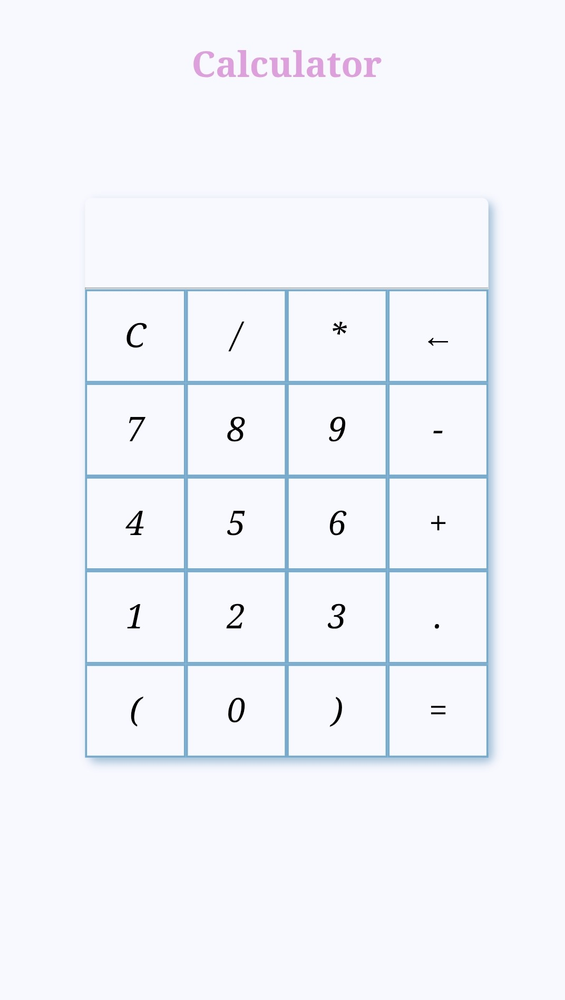

# 🧮 Calculator App  
### ⚡ LGMVIP Web Development Task – 2

A responsive and simple web-based **Calculator App** built using **HTML, CSS, and JavaScript**.  
It performs all basic arithmetic operations and adapts beautifully across devices.

🌐 **Live Demo**: [Click to Use Calculator](https://nehaatomar.github.io/LGMVIP-Web-Task-Number2/)

---

## 📸 Preview

  


---

## 💡 Features

- ➕ Addition  
- ➖ Subtraction  
- ✖️ Multiplication  
- ➗ Division  
- 🔁 Clear/Reset functionality  
- 📱 Fully responsive design — mobile & tablet ready  
- 🎯 Intuitive button-based input

---

## 🛠️ Tech Stack

| HTML5 | CSS3 | JavaScript |
|:-----:|:----:|:----------:|
| 🧱    | 🎨   | ⚙️         |

---

## 🚀 Getting Started

To run the app locally:

```bash
git clone https://github.com/NehaaTomar/LGMVIP-Web-Task-Number2.git
cd LGMVIP-Web-Task-Number2

```

## 📬 Connect with Me

[](https://inspiring-palmier-dd7dd4.netlify.app/)
[](https://github.com/NehaaTomar)
[](https://www.linkedin.com/in/neha-tomar-52b212224)
[](mailto:nehatomar349@gmail.com)
